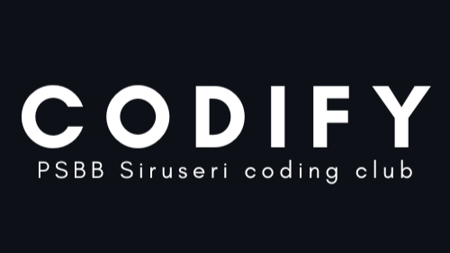

# Codify

  

Codify is an internal competition platform for a school coding club. It is designed for small events, fast review cycles, and a very simple student experience.

Students solve Python problems, test ideas in a browser-based interpreter, and submit solutions for manual review. Admins check the submissions, award XP, and control when the competition is open.

This project is intentionally lightweight. It is not a public SaaS product, and it is not built to be a feature-heavy contest platform.

## What This Platform Does

- Lets students view the current competition problem
- Lets students write and submit Python code
- Lets students test code in the browser with Pyodide
- Lets admins review submissions by hand
- Tracks XP and shows a live leaderboard
- Uses a simple ON/OFF competition state so admins can control access during events

## Who It Is For

This platform is built for:

- Students participating in school coding competitions
- Admins supervising the event in the computer lab
- Teachers and club leads who need a simple, reliable workflow

It is designed for a small group environment, not for open registration or public use.

## How It Works

1. An admin turns the competition ON.
2. Students sign in with their school account.
3. Students read the problem and write Python code.
4. Students test ideas in the browser interpreter.
5. Students submit their final code.
6. Admins review each submission manually.
7. Approved submissions award XP.
8. The leaderboard updates.
9. The admin turns the competition OFF when the session ends.

## Student Experience

Students only need a few screens:

- Competition page: problem statement, code editor, submit button, submission history
- Python interpreter: browser-only Python runtime for local testing
- Leaderboard: ranked by XP

The student flow is kept simple on purpose so the competition stays focused on problem solving instead of navigating the app.

## Admin Experience

Admins can:

- View all users
- Review pending submissions
- Approve or reject solutions
- Turn the competition ON or OFF
- Check the leaderboard
- Monitor submission history

Admin access is based on a hardcoded allowlist of school email addresses.

## Architecture At A Glance

The application uses a small serverless stack:

- Frontend: React + Vite on Cloudflare Pages
- Backend: Cloudflare Worker written in TypeScript
- Database: Cloudflare D1 (SQLite)
- App state: Cloudflare KV
- Authentication: Clerk
- Python execution: Pyodide in the browser only

Simple architecture is a core requirement. The backend does not run student code, and there are no extra services, containers, or microservices.

## Core Principles

- Simplicity first
- Manual review instead of automated judging
- Internal school tool, not a public platform
- Cloudflare-only infrastructure
- Browser-only Python execution

## Repository Structure

- `frontend/` React app
- `worker/` Cloudflare Worker API
- `database/` D1 migrations
- `shared/` shared types and utilities
- `docs/` project documentation
- `logos/` brand assets used in the README and other visuals

## Technology Stack

| Layer | Tooling |
| --- | --- |
| Frontend | React, Vite, TailwindCSS, shadcn/ui |
| Backend | Cloudflare Workers, TypeScript |
| Data | Cloudflare D1 |
| Global state | Cloudflare KV |
| Auth | Clerk |
| Browser Python | Pyodide |

## Project Goals

The platform is meant to be:

- Easy to understand
- Fast to run in a school lab
- Simple to maintain
- Safe for student use
- Clear for admins during live competitions

## Security And Rules

A few rules shape the system:

- Only school email addresses are allowed
- Admins are identified by a hardcoded list of emails
- Student code runs only in the browser
- The backend never executes Python
- The competition can be switched OFF so members can only see the leaderboard

## Development Notes

If you are working on this repo, the main idea is to keep the product small and readable. Prefer straightforward flows over clever abstractions.

When adding features, favor:

- Clear screens
- Minimal admin steps
- Simple database changes
- Explicit API responses
- UI that is easy to scan during a real competition session

## Deployment

The app is built and deployed through Cloudflare tooling.

- Frontend deployment target: Cloudflare Pages
- API deployment target: Cloudflare Workers
- Persistent data: D1
- Toggle state: KV

## In One Sentence

Codify is a simple school competition platform that helps students solve Python problems and helps admins review and score them without extra complexity.

