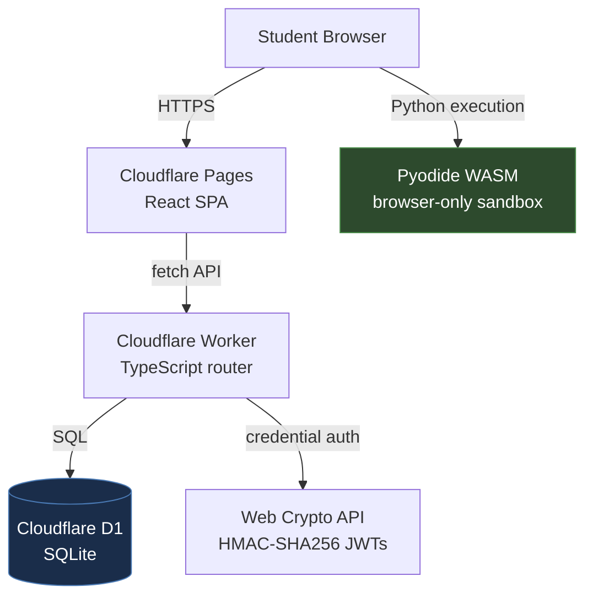

<p align="center">
  
</p>

# Codify

A private competition platform for a school coding club, built on Cloudflare's serverless stack. Students solve Python problems and submit solutions for manual admin review. Admins control the competition lifecycle and award XP.

---

## The problem

School coding competitions typically run on either borrowed external platforms (which require accounts, have irrelevant features, and are slow to configure) or ad-hoc Google Forms. Neither gives the organizer control over when the competition is open, a live leaderboard, or a browser-based Python environment students can use without installing anything.

This platform is purpose-built for a small-group, in-person event at PSBB Schools, replacing spreadsheets and manual coordination with a lightweight but complete workflow.

---

## Architecture

The backend is a single Cloudflare Worker. The frontend runs as a React SPA on Cloudflare Pages. Student Python code executes entirely in the browser via Pyodide (WebAssembly) — the backend never runs student code.


```mermaid
graph TD
    A[Student Browser] -->|HTTPS| B["Cloudflare Pages
    React SPA"]
    A -->|Python execution| P["Pyodide WASM
    browser-only sandbox"]
    B -->|fetch API| C["Cloudflare Worker
    TypeScript router"]
    C -->|SQL| D[("Cloudflare D1
    SQLite")]
    C -->|credential auth| E["Web Crypto API
    HMAC-SHA256 JWTs"]

    style P fill:#2d4a2d,color:#fff,stroke:#4a8c4a
    style D fill:#1a2d4a,color:#fff,stroke:#4a7ab5
```

Competition lifecycle is enforced at the database layer. A partial unique index ensures at most one competition can be in an active state at a time:

```sql
CREATE UNIQUE INDEX idx_competitions_one_current
  ON competitions((1)) WHERE reset_at IS NULL;
```

---

## What I built

**Competition lifecycle engine** — four phases (`idle → setup → live → ended → idle`) enforced through D1 SQL middleware guards. Non-admin users are restricted to the leaderboard outside of `live` phase.

**Custom authentication** — the initial plan used Clerk for authentication. After evaluating it, I replaced it with a built-in credential system: passwords hashed as `SHA-256(password + CODIFY_SALT)`, JWTs created and verified using the Web Crypto API (`crypto.subtle`, HMAC-SHA256), and domain restriction to `@psbbschools.edu.in`. Admin access is an allowlist of four email addresses in `schoolRules.ts`.

**Idempotent scoring under concurrent admin review** — when two admins approve the same submission simultaneously, XP must be awarded exactly once. This is solved with a 3-statement atomic D1 batch:

```sql
-- 1. Status transition succeeds only if still 'pending'
UPDATE submissions SET status='approved', reviewed_by=? WHERE id=? AND status='pending';

-- 2. Insert XP record only if the above succeeded (via subquery check)
INSERT INTO xp_awards (user_id, problem_id, submission_id, xp_awarded)
  SELECT ?, ?, ?, ? FROM submissions WHERE id=? AND status='approved' AND reviewed_by=?
  ON CONFLICT(user_id, problem_id) DO NOTHING;

-- 3. Update user XP only if a row was actually inserted above
UPDATE users SET xp = xp + ? WHERE id = ? AND changes() = 1;
```

**Browser-only Python execution** — Pyodide runs the student's code in a WebAssembly sandbox inside the browser tab. The backend receives only the raw source text as a string. There is no code execution server, no sandboxed container, and no subprocess.

---

## Technical challenges

### Serverless SQLite concurrency without row-level locking

Cloudflare D1 is serverless SQLite. There are no persistent database connections and no distributed transaction coordinator. Race conditions that would be trivially solved with `SELECT ... FOR UPDATE` in Postgres require a different approach.

The solution uses SQLite's native mechanisms:
- The partial unique index above handles "one active competition at a time" at the engine level.
- `BEFORE INSERT` triggers reject submissions if the competition is not in `live` state at insertion time, making the check atomic with the write.
- The idempotent XP scoring batch above uses `changes()` — a SQLite function that returns the number of rows affected by the most recent statement in the same connection — to gate the final `UPDATE`.

### Authentication pivot mid-development

Clerk was removed after recognizing that pre-created accounts (required for a controlled school environment) are a poor fit for Clerk's self-registration model. Replacing it required implementing JWT signing from scratch using the Web Crypto API, which is available natively in the Cloudflare Worker runtime without additional dependencies.

---

## Quick start (local development)

```bash
# Install dependencies
npm install

# Run the frontend (Vite dev server)
cd frontend && npm run dev

# Run the worker locally (Wrangler dev)
cd worker && npx wrangler dev
```

For production deployment, see [`docs/PRODUCTION_DEPLOYMENT.md`](./docs/PRODUCTION_DEPLOYMENT.md).

---

## Current status and limitations

**Status: internal tool, deployed privately.**

- This is not a public SaaS product. It is deployed for a specific school club at PSBB Schools.
- Authentication is credential-only with a hardcoded admin allowlist. There is no admin UI for user management; accounts are created by database migration.
- The original Clerk authentication reference remains in the README's architecture table — this is a documentation error. The actual implementation uses Web Crypto JWTs (see `worker/src/handlers/auth.ts`).
- Multi-problem competitions are supported in the data model. The UI currently presents one active problem at a time.

---

## Verification

The schema migrations are in `database/migrations/` (numbered 0001–0008). Each migration is a plain SQL file that can be inspected or re-run.

A production integrity check script is in `scripts/verify-production-integrity.py`. It validates that the D1 database constraints, triggers, and indexes are present and match the expected schema.
