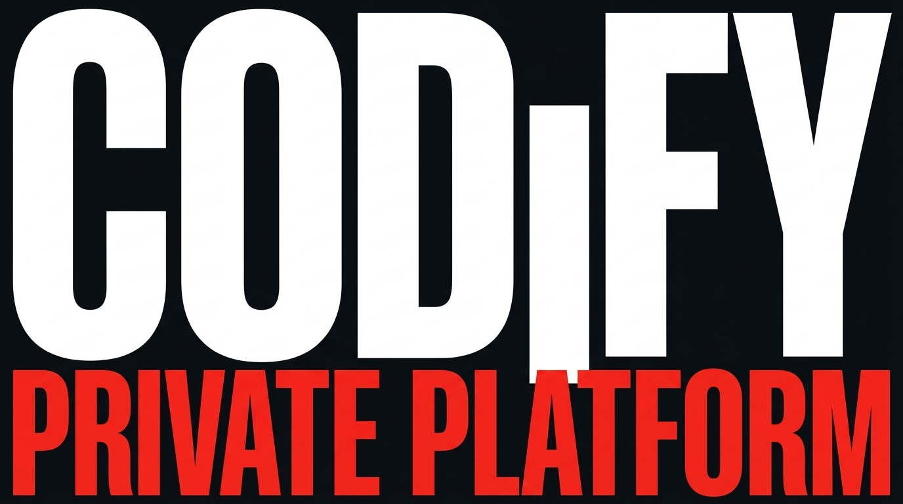
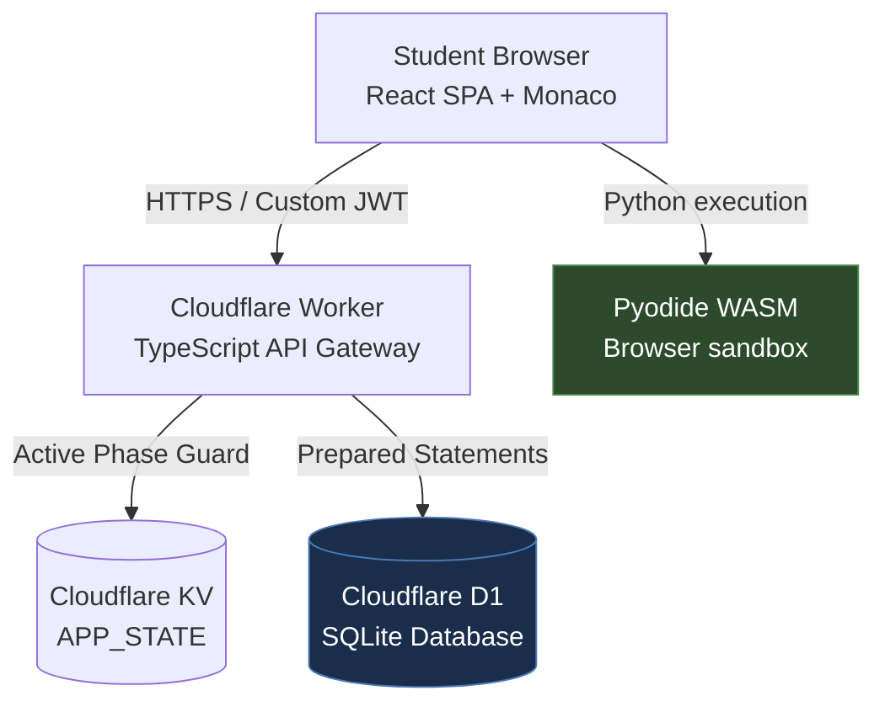

<div align="center">
  
</div>

# Codify

### A student-built coding platform for a student-run coding club.

Codify provides the infrastructure for coding sessions, practical programming tasks, competitions, submissions, scoring, rankings, and student progress. It was built for the needs of our school coding club rather than adapted from a generic competition platform.

---

## Why Codify exists

Codify was created to make coding education more practical and measurable. The platform supports:

- coding problems and practical assignments;
- student submissions;
- competition sessions;
- scoring and XP;
- rankings;
- progress tracking;
- instructor/organizer workflows;
- controlled access for school accounts.

---

## Current usage

| Metric | Value |
|---|---:|
| Student participants | ~50–68 registered (Grades in 9-10 cohort) |
| School branches served | 1 (PSBB Schools) |
| Active club supervision | 4 student admins / club leads |
| Typical live lab session | ~30 concurrent participants |
| Problem bank | 10+ curated algorithmic problems |
| Submissions recorded | Multi-problem batch submissions |

*All figures are based on internal platform records and may change over time.*

---

## Architecture

The platform uses a lightweight, serverless architecture running on Cloudflare, with all student Python execution isolated client-side in the browser:


```mermaid
graph TD
    A["Student Browser
    React SPA + Monaco"] -->|HTTPS / Custom JWT| B["Cloudflare Worker
    TypeScript API Gateway"]
    A -->|Python execution| P["Pyodide WASM
    Browser sandbox"]
    B -->|Active Phase Guard| C[("Cloudflare KV
    APP_STATE")]
    B -->|Prepared Statements| D[("Cloudflare D1
    SQLite Database")]
    
    style P fill:#2d4a2d,color:#fff,stroke:#4a8c4a
    style D fill:#1a2d4a,color:#fff,stroke:#4a7ab5
```

- **Client-Side Execution**: Pyodide runs Python in a WebAssembly sandbox inside the student's browser tab. The backend never executes student code, eliminating remote code execution vulnerabilities and complex container sandboxes.
- **Edge Gateway**: A stateless Cloudflare Worker serves API requests and enforces authentication and rate boundaries.
- **State & Persistence**: Cloudflare KV coordinates real-time competition phases (`idle`, `setup`, `live`, `ended`) while Cloudflare D1 (serverless SQLite) stores persistent problem banks, submissions, and XP awards.

---

## Hardest engineering problem

### Correct scoring under concurrent submissions

The platform needed to prevent:

- duplicate XP awards;
- repeated scoring of the same submission;
- edits to problems during live competitions;
- overlapping active competition states;
- inconsistent rankings caused by repeated requests.

Because the backend uses serverless SQLite through Cloudflare D1, the design relies on database constraints, trigger logic, and atomic statement batches rather than assuming traditional distributed row-level locking.

#### 1. Atomic XP Award Batch
When administrators review submissions simultaneously, XP must be credited exactly once. This is guaranteed using a 3-statement atomic D1 transaction leveraging SQLite's native `changes()` function:

```sql
-- Step 1: Transition status only if still 'pending'
UPDATE submissions SET status='approved', reviewed_by=? WHERE id=? AND status='pending';

-- Step 2: Insert XP record only if the update succeeded
INSERT INTO xp_awards (user_id, problem_id, submission_id, xp_awarded)
  SELECT ?, ?, ?, ? FROM submissions WHERE id=? AND status='approved' AND reviewed_by=?
  ON CONFLICT(user_id, problem_id) DO NOTHING;

-- Step 3: Increment user XP only if a new row was actually inserted above
UPDATE users SET xp = xp + ? WHERE id = ? AND changes() = 1;
```

#### 2. Single-Active-Competition Invariant
To prevent overlapping competitions from corrupting scores, a partial unique index enforces that at most one competition can exist in an unreset state:

```sql
CREATE UNIQUE INDEX idx_competitions_one_current
  ON competitions((1)) WHERE reset_at IS NULL;
```

#### 3. Live Problem Protection Trigger
To ensure competition integrity, database triggers prevent problems from being modified or deleted while an associated competition is actively `live`:

```sql
CREATE TRIGGER protect_live_competition_problem_update
BEFORE UPDATE ON problems
FOR EACH ROW
WHEN EXISTS (
  SELECT 1 FROM competition_problems cp
  JOIN competitions c ON c.id = cp.competition_id
  WHERE cp.problem_id = OLD.id AND c.status = 'live'
)
BEGIN
  SELECT RAISE(ABORT, 'Cannot modify problem while linked competition is live');
END;
```

---

## Access control

Codify uses a custom authentication flow based on JWT, HMAC, and WebCrypto. Access is restricted to the school's approved account domain. This was designed specifically for the school environment and should not be interpreted as a general-purpose identity platform.

- **Account Restrictions**: Pre-created student accounts scoped to `@psbbschools.edu.in`. Public registration is disabled at the API level.
- **Credential Storage**: Passwords are authenticated using SHA-256 with an environment salt (`CODIFY_SALT`) stored as an encrypted Worker secret.
- **Hardened Signature Verification**: Custom JWT verification using WebCrypto (`crypto.subtle`) imports the key strictly with `{ name: "HMAC", hash: "SHA-256" }`. It does not parse the `alg` header from the token, completely preventing `"alg": "none"` bypass attacks.
- **Admin Privilege Allowlist**: Administrator privileges are verified server-side using a dual-check: database role assertion plus an immutable email allowlist (`schoolRules.ts`).

---

## My role

I designed and implemented the platform's core application and infrastructure, including:

- frontend workflows;
- code-editor integration;
- browser-based Python execution;
- competition lifecycle handling;
- backend API routes;
- D1 schema and migrations;
- scoring and idempotency safeguards;
- authentication and access restrictions;
- rankings and progress interfaces;
- deployment and operational workflows.

---

## Development setup

This project is intended for the Codify organization and school environment.

### Requirements

- Node.js (v18+)
- Cloudflare Wrangler CLI
- access to the relevant Cloudflare D1 database and KV namespaces
- approved school-domain credentials
- Python/Pyodide development dependencies, where applicable
